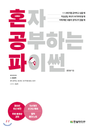

# :pencil2: Python Study Repository

- 파이썬 기초 개념 공부 저장소
   
   

## 나도코딩 - 6시간만에 파이썬 배우기

> 강의 : https://youtu.be/kWiCuklohdY

> :heavy_check_mark: [관련 코드 바로가기](nadocoding)

 

## 혼자 공부하는 파이썬 - 윤인성 저

> :heavy_check_mark: [관련 코드 바로가기](hongongpa)
